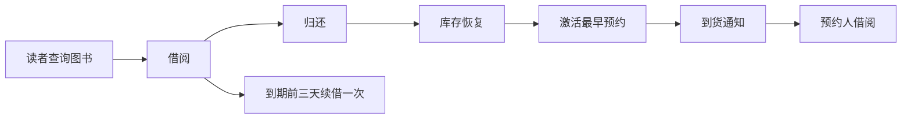
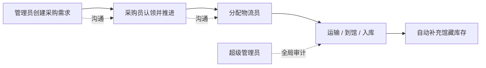
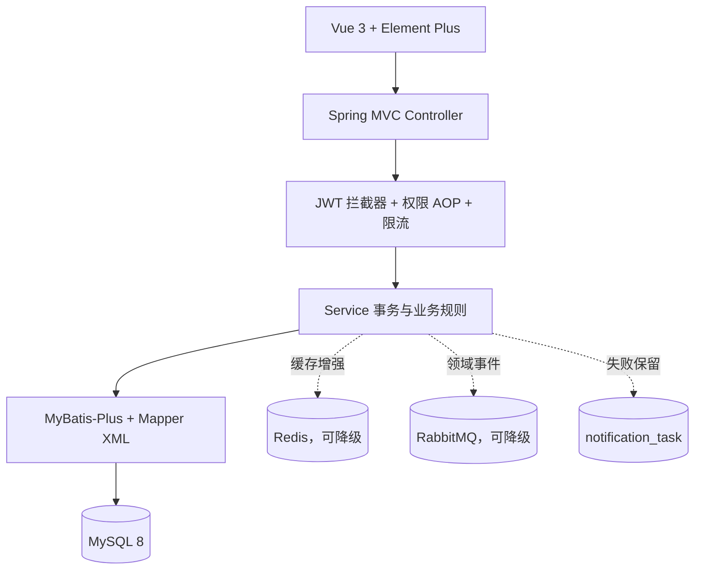

# 暗室藏书（DarkRoomLibrary）

一个基于 Spring Boot、MyBatis-Plus、Vue 3 与 MySQL 的前后端分离图书管理系统。它不只完成图书增删改查，而是把读者借阅、预约续借、书评互动、内容审核、采购物流、文件治理、操作审计和中间件降级连接成完整业务闭环。

## 项目一览

| 维度 | 当前实现 |
| --- | --- |
| 基础角色 | 超级管理员、管理员、读者、采购员、物流员 |
| 管理授权 | 超级管理员可在管理员中任命“馆务协调员”；它是能力标记，不是第六类角色 |
| 数据模型 | 19 张 MySQL 业务表，包含外键、唯一约束、状态字段和审计记录 |
| 后端结构 | 单体分层：Controller → Service → Mapper/XML → MySQL |
| 中间件 | Redis、RabbitMQ 可选启用，故障时自动降级，不阻断核心业务 |
| 自动测试 | 后端 225 项、前端 31 项；五角色全链路 75 次真实 API 响应；单实例并发 20 个场景 / 393 次请求，双实例并发 6 个场景 / 125 次请求 |
| 前端体验 | 读者端“暗室藏书”叙事界面；管理端宣纸/竹简主题；桌面与移动端适配 |

## 系统解决什么问题

普通图书管理项目通常停在“录入图书、查询图书”。本项目进一步处理真实流程中的四类问题：

1. **流通闭环**：借书、归还、续借、预约排队、到期提醒、逾期罚款和库存恢复相互联动。
2. **职责闭环**：管理员提出采购需求，采购员处理订单，物流员同步运输，入库后自动补充库存。
3. **内容闭环**：读者书评、点赞、回复和举报，管理员审核、隐藏或忽略，关键操作全部留痕。
4. **可靠性闭环**：Redis、RabbitMQ 和邮件不是核心事务的单点依赖；不可用时回到内存、MySQL 或补偿任务。核心业务保持数据库强一致，旁路通知和审计按提交后至少一次 / 最佳努力语义处理。

## 五类角色

| 角色 | 主要职责 | 明确边界 |
| --- | --- | --- |
| 超级管理员 | 全局用户与权限、文件治理、采购物流总览、完整审计 | 保留系统最终控制权，不能误删自身核心账号 |
| 管理员 | 馆藏、借阅、公告、内容审核、采购需求 | 不能修改同级管理员、馆务协调员或超级管理员 |
| 读者 | 查询、借还、续借、预约、收藏、留言、书评互动 | 只能操作自己的业务数据，可自行注销账号 |
| 采购员 | 认领/处理采购单、分配物流员、岗位通信 | 不能管理用户和馆藏基础数据 |
| 物流员 | 更新承运、运输、到馆和入库进度 | 只能处理分配给自己的物流任务 |

“馆务协调员”仍属于管理员角色，由超级管理员任免，用于跨管理员协调采购事项；它不会获得超级管理员的文件治理和全局权限。

## 核心业务闭环





## 技术架构



核心库存始终以 MySQL 为准。并发借阅使用条件更新保证库存不会变成负数，不使用 Redis 保存最终库存，也不采用不必要的微服务/TCC 复杂度。

## 技术栈

- 后端：JDK 17、Spring Boot 3.5.16、Spring MVC、MyBatis-Plus 3.5.17
- 数据：MySQL 8、Redis 5（可选增强）、RabbitMQ 4（可选增强）
- 安全：JWT、BCrypt、登录数学验证码、邮箱验证码场景隔离、登录失败锁定、AOP 权限控制
- 前端：Vue 3.5.40、Vue Router 4、Element Plus 2.14.3、ECharts 6.1、Vite 8.1.5
- 工程：Maven、npm、JUnit 5、H2、Vitest、ESLint、Playwright E2E 脚本

## 目录结构

```text
DarkRoomLibrary/
├─ backend/dark-room-library-api/       Spring Boot 后端与自动测试
├─ frontend/dark-room-library-web/  Vue 前端、单元测试和 E2E 脚本
├─ sql/init-dark-room-library.sql   建库、表结构与演示数据的唯一入口
├─ docs/                            架构、模块图、验收清单和项目介绍
├─ scripts/package-release.ps1      生成干净源码交付包
└─ release/                         本地生成的交付产物，不进入 Git
```

## 快速启动

### 1. 环境要求

- JDK 17、Maven 3.8+
- Node.js 22+、npm
- MySQL 8
- Redis、RabbitMQ 可选；默认关闭

### 2. 初始化数据库

```powershell
cmd /c "mysql --default-character-set=utf8mb4 -u root -p < sql\init-dark-room-library.sql"
```

这是数据库的唯一入口。执行一次会创建 `dark_room_library`、19 张业务表、基础分类与书架，
并写入虚构书目、书评、留言、公告、采购物流记录和五类本地演示账号：

| 角色 | 账号 | 密码 |
| --- | --- | --- |
| 超级管理员 | `drl_root_aurora` | `DarkRoom@20606` |
| 馆务协调员 | `drl_keeper_qingwu` | `DarkRoom@20606` |
| 读者 | `drl_reader_yandeng` | `DarkRoom@20606` |
| 采购员 | `drl_buyer_xinglan` | `DarkRoom@20606` |
| 物流员 | `drl_logistics_chenxiang` | `DarkRoom@20606` |

这些账号只用于本地展示和验收。面向公网部署前必须删除演示账号，或逐个修改账号和密码。
运行 E2E 时可统一设置 `$env:DRL_DEMO_PASSWORD="DarkRoom@20606"`；也可以使用各角色独立的密码环境变量覆盖它。

### 3. 启动后端

本地默认数据库账号为 `root/root`。如果本机不同，可先设置环境变量：

```powershell
$env:DB_USERNAME="root"
$env:DB_PASSWORD="your-mysql-password"
cd backend/dark-room-library-api
mvn spring-boot:run
```

后端地址：`http://localhost:20606/api/dark-room-library/v1`

### 4. 启动前端

```powershell
cd frontend/dark-room-library-web
npm ci
npm run dev
```

浏览器访问：`http://localhost:5175`

### 5. 启用邮件

注册、重置密码、预约到货和借阅到期提醒需要邮箱 SMTP 授权码：

```powershell
$env:MAIL_USERNAME="your-email@example.com"
$env:MAIL_PASSWORD="your-mail-authorization-code"
```

授权码只应保存在环境变量中，不要写入 Git。

## 可选中间件与降级

```powershell
$env:REDIS_ENABLED="true"
$env:RABBITMQ_ENABLED="true"
```

| 故障 | 系统行为 |
| --- | --- |
| Redis 不可用 | 验证码和登录风控切换到内存；查询直接访问 MySQL |
| RabbitMQ 不可用 | 核心事务照常提交；通知任务保留在数据库中等待补偿，操作审计按提交后单独写库处理 |
| 邮件不可用 | 通知保留失败原因并由定时任务重试；借还和预约事务仍成功 |

## 文件生命周期

上传文件先登记为临时文件，业务保存时再绑定到图书封面、用户头像、留言附件或公告资源。超级管理员可以查看引用状态并安全清理；系统默认每天 `03:30` 清理超过 24 小时的未绑定临时文件。

可通过 `FILE_UPLOAD_DIR`、`FILE_TEMP_RETENTION_HOURS`、`FILE_CLEANUP_CRON` 覆盖默认策略。HTML 附件只允许下载，不允许内联执行。

## 测试与构建

```powershell
cd backend/dark-room-library-api
mvn clean test
```

```powershell
cd frontend/dark-room-library-web
npm run lint
npm run test:unit
npm run build
```

需连接真实服务和测试账号时，再执行 `tests/e2e` 中的读者、管理员、采购物流、全流程、并发一致性与浏览器诊断脚本。完整命令和证据见 [最终验证报告](docs/verification-report.md)，人工复核步骤见 [验收清单](docs/manual-acceptance-checklist.md)。

2026-07-27 最终回归结果：

- 后端 `225/225` 通过，前端单元测试 `31/31` 通过。
- ESLint、Vite 生产构建和 npm 官方 registry 安全审计通过，审计结果为 `0 vulnerabilities`。
- 五个演示账号全部真实登录，完整流程记录 75 次 API 响应，覆盖借还、权限切换、采购、物流、入库和库存幂等。
- 单实例并发一致性测试覆盖 20 个场景、393 次请求，最大场景 P95 为 117 ms；双实例共享 MySQL 测试覆盖 6 个场景、125 次请求，最大场景 P95 为 119 ms。两组测试均未出现违反业务不变量的结果。
- 浏览器诊断完成 86 个路由检查、248 次 API 响应和 3968 次总网络响应；Console 错误/警告、页面异常、失败请求、网络错误和页面横向溢出均为 0。
- 数据库完成 27 条外键关系检查，孤儿记录与领域不变量违规均为 0。
- Redis 使用真实缓存键和 TTL 验证；RabbitMQ 故障恢复与队列消费通过。最终并发套件保留 2 条发送到虚构 `.local` 地址的可补偿通知任务，用于验证邮件失败后的租约、重试和恢复路径，不属于业务一致性违规。

并发脚本验证的是当前机器和数据规模下的正确性与有限延迟，不是生产容量承诺。事务边界、锁顺序、多实例限制、提交后副作用和未来拆分方案见
[架构审查](docs/architecture-review.md)。

真实全链路测试使用独立数据库，避免污染开发数据：

```powershell
$env:DB_USERNAME="root"
$env:DB_PASSWORD="your-mysql-password"
pwsh -File .\scripts\setup-e2e-database.ps1 -Reset
$env:DB_URL="jdbc:mysql://127.0.0.1:3306/dark_room_library_e2e?characterEncoding=UTF-8&useSSL=false&serverTimezone=GMT%2B8&allowPublicKeyRetrieval=true"
```

后端启动后，可通过真实登录、上传和业务绑定接口安装演示头像与封面：

```powershell
$env:DRL_DEMO_PASSWORD="DarkRoom@20606"
pwsh -File .\scripts\seed-demo-media.ps1
```

## 生产配置

生产环境启用 `prod` Profile，并强制提供数据库、JWT、邮件和 CORS 环境变量。缺少关键变量时启动失败，避免使用开发默认值：

```powershell
$env:SPRING_PROFILES_ACTIVE="prod"
$env:DB_URL="jdbc:mysql://localhost:3306/dark_room_library?characterEncoding=UTF-8&useSSL=false&serverTimezone=GMT%2B8"
$env:DB_USERNAME="book_app"
$env:DB_PASSWORD="change-me"
$env:JWT_SECRET="at-least-32-bytes-random-secret"
$env:MAIL_USERNAME="your-email@example.com"
$env:MAIL_PASSWORD="your-mail-authorization-code"
$env:CORS_ORIGINS="https://your-frontend.example.com"
```

前后端分域部署时，从 `.env.production.example` 创建 `.env.production` 并配置 `VITE_API_BASE_URL`；同域反向代理 `/api` 时可保持默认值。

## 文档导航

- [文档总览与阅读路线](docs/README.md)
- [系统设计与关键业务规则](docs/system-design.md)
- [架构审查：事务、竞态与演进边界](docs/architecture-review.md)
- [功能模块图（Mermaid）](docs/function-module-diagram.md)
- [功能模块图（独立 HTML）](docs/library-system-modules.html)
- [人工验收清单](docs/manual-acceptance-checklist.md)
- [项目沿革与 Git 说明](docs/project-history.md)
- [最终验证报告](docs/verification-report.md)
- [项目起源 PDF](docs/暗室藏书_项目起源.pdf)
- [项目计划书 PDF](docs/暗室藏书_项目计划书.pdf)
- [项目工程复盘 PDF](docs/暗室藏书项目复盘.pdf)
- [项目介绍 PPT](docs/DarkRoomLibrary-project-overview.pptx)
- [数据库初始化脚本](sql/init-dark-room-library.sql)

## 交付

提交全部修改并确认 `git status` 工作区干净后，在项目根目录执行：

```powershell
pwsh -File .\scripts\package-release.ps1
```

脚本只归档当前 `HEAD` 已提交的 Git 跟踪文件，并生成：

```text
release/release.zip
release/release.zip.sha256
```

压缩包内统一使用 `DarkRoomLibrary/` 根目录。未跟踪文件、Git 忽略文件以及 `.git` 元数据不会进入交付包；工作区存在未提交内容时，脚本会直接拒绝打包，避免源码与交付物版本不一致。

## 项目边界

这是面向单机/小团队部署的增强型 Spring Boot 单体项目，不引入 Spring Cloud、分库分表、Elasticsearch、TCC 或异步扣库存。大模型助手属于后续可选模块，当前核心系统不依赖大模型。

## 项目沿革

暗室藏书的想法形成于 2026 年 5 月，最初目标就是设计一套有明确角色、业务秩序和阅读氛围的图书馆系统。2026 年 7 月大二短学期期间，学校布置的基础任务范围较小，作者因此把课程作业作为落地契机，主动将原本的个人构想扩展为完整项目。

课程执行阶段曾使用教师发放的未完成教学底座，但当前公开版本的前端、后端、数据模型、业务闭环、视觉系统和验证体系已经完成独立重构。课程提交后，作者继续补齐借阅与预约、书评与审核、采购与物流、文件治理、通知补偿、并发一致性等能力，并迁移到 Vue 3/Vite、Java 17、Spring Boot 3 和 MyBatis-Plus。

项目最初被当作一次性 demo，因此 Git 在重构中途才加入。仓库不会伪造更早的提交或日期，首次提交只代表经过审查的公开基线，不代表此前没有开发过程。更完整的时间线见 [项目沿革与 Git 说明](docs/project-history.md)。

## 来源与许可证

教师发放的教学底座不是项目想法的来源，也不是当前系统的主体实现。归档原件与当前仓库的对比显示，两者在技术栈、包结构、数据库规模、角色模型和业务范围上已经是不同工程；公开版本不包含与原件逐字节相同的源码或配置文件。

项目源码采用 [MIT License](LICENSE) 开源。第三方依赖、字体、图片及其他外部素材仍遵循各自的许可证或使用条款；来源审计范围和当前边界见 [NOTICE.md](NOTICE.md)。

## 参与与安全

参与贡献前请阅读 [CONTRIBUTING.md](CONTRIBUTING.md)，安全问题请按 [SECURITY.md](SECURITY.md) 中的方式报告。
