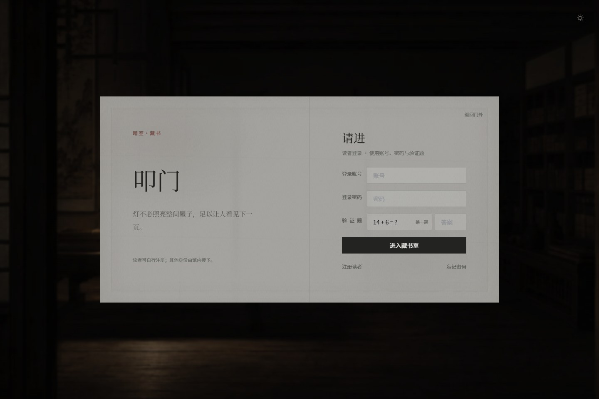
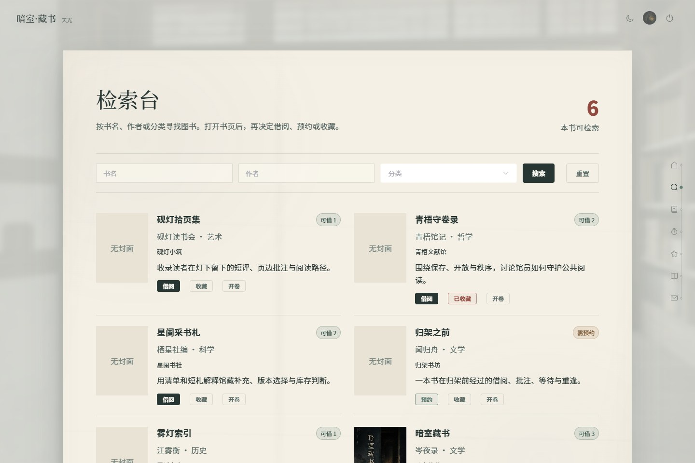
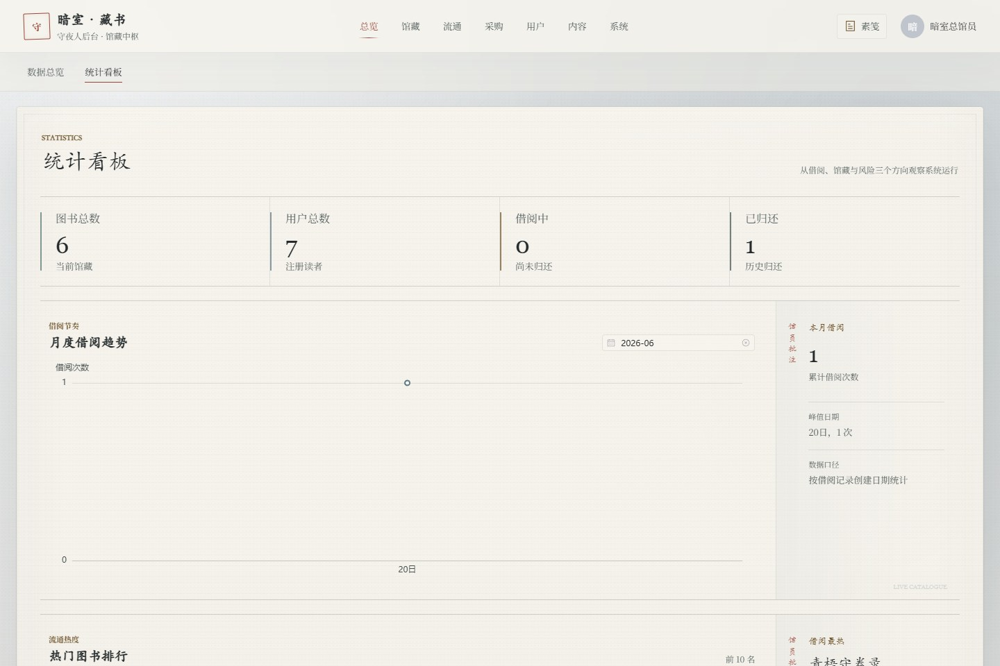
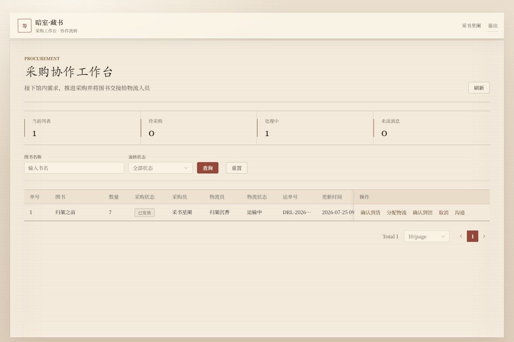

# 暗室藏书（DarkRoomLibrary）

[](https://github.com/NoctilumeDev/DarkRoomLibrary/actions/workflows/ci.yml)
[](https://github.com/NoctilumeDev/DarkRoomLibrary/actions/workflows/security.yml)
[](https://github.com/NoctilumeDev/DarkRoomLibrary/actions/workflows/pages.yml)

## 这是什么

暗室藏书是一个基于 Spring Boot、MyBatis-Plus、Vue 3 与 MySQL 的前后端分离图书管理系统。它围绕读者流通、内容治理和采购物流三个真实业务链路展开，而不是只展示图书增删改查。

项目采用面向单机和小团队部署的增强型单体架构：核心库存和业务状态由 MySQL 保持强一致，Redis 与 RabbitMQ 作为可降级增强，不引入与当前规模不匹配的微服务、分库分表或分布式事务复杂度。

当前公开版本已完成独立重构。项目沿革见 [Git 说明](docs/project-history.md)，来源与第三方许可边界见 [NOTICE](NOTICE.md)，源码采用 [MIT License](LICENSE)。

## 立即体验

**在线演示：** [在浏览器体验六个固定权限身份](https://noctilumedev.github.io/DarkRoomLibrary/)

Pages 演示使用独立的浏览器会话数据，不连接真实后端和数据库；借还、预约收藏、可解释荐书、书评留言、采购物流和幂等入库可以直接体验，上传下载、邮件、注册、注销与数据导出会明确阻止。真实事务、中间件和并发一致性请使用下方完整环境验证。

| 登录与昼夜氛围 | 读者阅览室 |
| --- | --- |
|  |  |

| 图书检索与借阅 | 管理端统计看板 |
| --- | --- |
|  |  |

| 采购物流协作 |
| --- |
|  |

## 核心能力与证据

- **流通闭环**：借书、归还、续借、预约排队、到期提醒、逾期罚款与库存恢复联动。
- **职责闭环**：管理员发起采购，采购员认领和分配，物流员推进运输，到馆入库后自动补充库存。
- **内容闭环**：书评、点赞、回复、举报与审核形成治理链路，关键操作留痕。
- **推荐闭环**：收藏为主、借阅和评分为辅，提供可解释推荐、隐私开关、行为归因和“不感兴趣”。
- **可靠性边界**：核心事务以数据库为准；缓存、消息和邮件故障时降级或补偿，不阻断借还等主流程。

| 验证维度 | v1.2.7 后端安全修复候选与 v1.2.6 / v1.2.4 / v1.2.3 已发布基线 |
| --- | --- |
| 自动测试 | 后端候选 `290/290`，行覆盖率 `72.48%`；前端已发布基线 `68/68`，关键逻辑范围行覆盖率 `71.47%`，ESLint、构建和 npm 审计通过 |
| 角色链路 | 5 个角色码、6 个固定权限身份真实登录，`v1.2.4` 完成 `70` 次页面 API 全链路 |
| 多实例一致性 | 20 场景 `393` 次并发回归于 `v1.2.4` 重跑；3 个后端实例的 8 场景 `176` 次请求保留为 `v1.2.3` 历史基线 |
| 推荐并发 | 8 个首次并发请求只生成 1 个批次，三实例得到一致的协同结果 |
| 浏览器诊断 | 116 个路由、456 次 API 响应、6,114 次网络响应；Console、失败请求与横向溢出为 0 |
| 数据与中间件 | 24 张表、34 条外键；Redis AOF、请求 ID、CSP、安全响应头、RabbitMQ 毒消息转移与多实例死信告警通过 |

公开覆盖率报告：[后端 JaCoCo](https://noctilumedev.github.io/DarkRoomLibrary/coverage/backend/) · [前端 Vitest V8](https://noctilumedev.github.io/DarkRoomLibrary/coverage/frontend/)。后端模块与前端关键逻辑范围均在 GitHub Actions 中执行至少 70% 的行覆盖率门禁；Vue 组件、路由守卫和真实页面行为另由组件测试及浏览器 E2E 验证，不把局部覆盖率包装成整个前端代码库覆盖率。

技术栈为 JDK 17、Spring Boot 3.5.16、MyBatis-Plus 3.5.17、MySQL 8、Vue 3.5.40、Element Plus 2.14.3、ECharts 6.1 和 Vite 8.1.5。完整的事务边界、竞态分析、测试条件与原始结论见 [架构审查](docs/architecture-review.md) 和 [最终验证报告](docs/verification-report.md)。这些结果证明当前环境下的正确性，不构成生产容量承诺。

**维护状态：** `v1.2.0` 起冻结功能范围。仓库继续接受明确缺陷、安全、依赖兼容、测试和文档修正，不再主动增加大型领域模块；具体边界见 [贡献指南](CONTRIBUTING.md)。

当前版本、自动测试和真实链路证据的机器可读边界见 [验证基线](.github/verification-baseline.json)，版本演进见 [CHANGELOG](CHANGELOG.md)。

## 如何运行

### Docker Compose

安装 Docker Desktop 后，在项目根目录执行：

```powershell
Copy-Item .env.compose.example .env
docker compose up --build -d
docker compose ps
```

访问 `http://localhost:5175`，后端地址为 `http://localhost:20606/api/dark-room-library/v1`。MySQL、Redis、RabbitMQ 和 RabbitMQ 管理页的宿主机默认端口分别为 `3307`、`6380`、`5673`、`15673`。

`.env.compose.example` 仅用于本地演示。公开部署前必须更换数据库密码、JWT 密钥、邮件配置、CORS 配置和六个演示账号；完整说明见 [部署指南](docs/deployment.md)。

### 本机直接运行

准备 JDK 17、Maven 3.8+、Node.js 22+、npm 和 MySQL 8。Redis、RabbitMQ 默认关闭，可按需启用。

1. 使用唯一 SQL 入口初始化数据库：

```powershell
cmd /c "mysql --default-character-set=utf8mb4 -u root -p < sql\init-dark-room-library.sql"
```

2. 启动后端：

```powershell
cd backend/dark-room-library-api
mvn spring-boot:run
```

3. 启动前端：

```powershell
cd frontend/dark-room-library-web
npm ci
npm run dev
```

本地 SQL 提供六个验收身份：

| 身份 | 账号 | 密码 |
| --- | --- | --- |
| 超级管理员 | `drl_root_aurora` | `DarkRoom@20606` |
| 馆务协调员 | `drl_keeper_qingwu` | `DarkRoom@20606` |
| 普通管理员 | `drl_admin_mozhou` | `DarkRoom@20606` |
| 读者 | `drl_reader_yandeng` | `DarkRoom@20606` |
| 采购员 | `drl_buyer_xinglan` | `DarkRoom@20606` |
| 物流员 | `drl_logistics_chenxiang` | `DarkRoom@20606` |

这些账号只用于本地展示和验收，公网部署前必须删除或修改。数据库、邮件、JWT、CORS、中间件、文件目录和生产 Profile 的环境变量见 [部署指南](docs/deployment.md)。

### 检查与深入阅读

```powershell
cd backend/dark-room-library-api
mvn clean verify
```

```powershell
cd frontend/dark-room-library-web
npm run lint
npm run test:coverage
npm run build
npm run build:demo
```

涉及角色、库存、预约、采购物流、推荐或浏览器行为时，还应运行 `frontend/dark-room-library-web/tests/e2e` 中对应的真实服务脚本。Windows 单机执行高连接测试前先阅读 [网络边界](docs/local-test-network-boundary.md)，并保持后端、并发和浏览器阶段串行。

从 [文档中心](docs/README.md) 进入完整资料，重点包括 [系统设计](docs/system-design.md)、[架构审查](docs/architecture-review.md)、[部署指南](docs/deployment.md)、[人工验收清单](docs/manual-acceptance-checklist.md) 与 [最终验证报告](docs/verification-report.md)。参与贡献前请阅读 [CONTRIBUTING](CONTRIBUTING.md)，安全问题按 [SECURITY](SECURITY.md) 报告。
