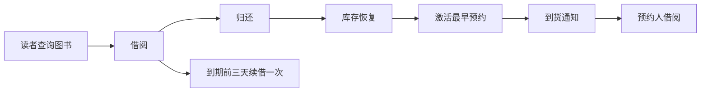
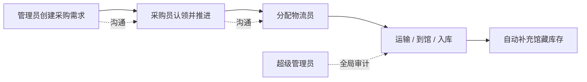
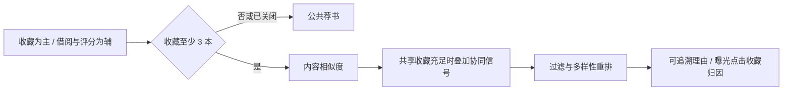
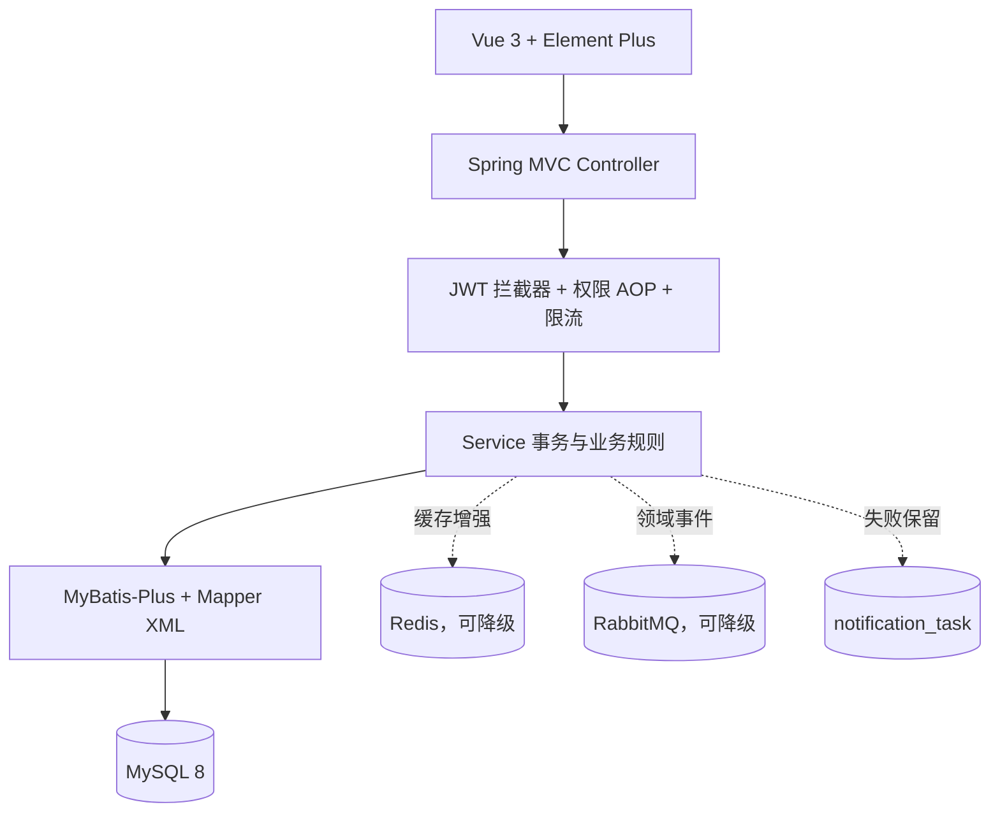

# 暗室藏书（DarkRoomLibrary）

[](https://github.com/NoctilumeDev/DarkRoomLibrary/actions/workflows/ci.yml)
[](https://github.com/NoctilumeDev/DarkRoomLibrary/actions/workflows/pages.yml)

一个基于 Spring Boot、MyBatis-Plus、Vue 3 与 MySQL 的前后端分离图书管理系统。它不只完成图书增删改查，而是把读者借阅、预约续借、可解释荐书、书评互动、内容审核、采购物流、文件治理、操作审计和中间件降级连接成完整业务闭环。

**在线演示：** [直接在浏览器体验六个固定身份](https://noctilumedev.github.io/DarkRoomLibrary/)

在线演示是为 GitHub Pages 单独构建的浏览器会话环境：不连接真实后端或数据库，数据只保存在当前标签页会话中，可随时重置。它保留借还与库存联动、预约收藏、可解释荐书、书评留言、采购物流和幂等入库等关键流程；上传下载、邮件、注册、注销和数据导出会明确阻止。需要验证 Spring Boot、MySQL、Redis、RabbitMQ、文件治理与真实并发一致性，请使用下方 Docker Compose 或本机完整环境。

## 项目一览

| 维度 | 当前实现 |
| --- | --- |
| 权限模型 | 5 个角色码：超级管理员、管理员、读者、采购员、物流员 |
| 固定身份 | 6 个验收身份：超级管理员、馆务协调员、普通管理员、读者、采购员、物流员；馆务协调员仍使用管理员角色码 |
| 数据模型 | 23 张 MySQL 业务与派生表，另有 1 张邮箱配额技术控制表；包含 34 条外键、唯一约束、状态字段和审计记录 |
| 后端结构 | 单体分层：Controller → Service → Mapper/XML → MySQL |
| 中间件 | Redis、RabbitMQ 可选启用，故障时自动降级，不阻断核心业务 |
| 自动测试 | 后端 237 项、前端 37 项；6 个固定权限身份全链路通过；推荐闭环在三实例首次并发生成下只落 1 个批次；既有三实例强并发基线共 1,986 次场景请求 |
| 前端体验 | 读者端“暗室藏书”叙事界面与“沿着书签”荐书；管理端宣纸/竹简主题；桌面与移动端适配 |

## 项目实景

以下截图来自真实前后端与测试数据库，不是静态设计稿：

| 登录与昼夜氛围 | 读者阅览室 |
| --- | --- |
|  |  |

| 图书检索与借阅 | 管理端统计看板 |
| --- | --- |
|  |  |

| 采购物流协作 |
| --- |
|  |

## 系统解决什么问题

普通图书管理项目通常停在“录入图书、查询图书”。本项目进一步处理真实流程中的五类问题：

1. **流通闭环**：借书、归还、续借、预约排队、到期提醒、逾期罚款和库存恢复相互联动。
2. **职责闭环**：管理员提出采购需求，采购员处理订单，物流员同步运输，入库后自动补充库存。
3. **内容闭环**：读者书评、点赞、回复和举报，管理员审核、隐藏或忽略，关键操作全部留痕。
4. **可靠性闭环**：Redis、RabbitMQ 和邮件不是核心事务的单点依赖；不可用时回到内存、MySQL 或补偿任务。核心业务保持数据库强一致，旁路通知和审计按提交后至少一次 / 最佳努力语义处理。
5. **推荐闭环**：收藏达到 3 本后，以收藏为主、借阅与高评分为辅生成可解释内容推荐；共享收藏数据足够时才启用协同信号，并提供公共降级、隐私开关和派生记录清除。

## 五个角色码与六个固定权限身份

| 角色 | 主要职责 | 明确边界 |
| --- | --- | --- |
| 超级管理员 | 全局用户与权限、文件治理、采购物流总览、完整审计 | 保留系统最终控制权，不能误删自身核心账号 |
| 管理员 | 馆藏、借阅、公告、内容审核、采购需求 | 不能修改同级管理员、馆务协调员或超级管理员 |
| 读者 | 查询、借还、续借、预约、收藏、可解释荐书、留言、书评互动 | 只能操作自己的业务数据，可关闭个性化并清除推荐记录，可自行注销账号 |
| 采购员 | 认领/处理采购单、分配物流员、岗位通信 | 不能管理用户和馆藏基础数据 |
| 物流员 | 更新承运、运输、到馆和入库进度 | 只能处理分配给自己的物流任务 |

“馆务协调员”仍属于管理员角色码 `1`，由超级管理员任免，用于跨管理员协调采购事项；普通管理员与馆务协调员因此构成两个不同的固定权限身份，但不会增加新的角色码，也不会获得超级管理员的文件治理和全局权限。

## 核心业务闭环







## 技术架构



核心库存始终以 MySQL 为准。并发借阅使用条件更新保证库存不会变成负数，不使用 Redis 保存最终库存，也不采用不必要的微服务/TCC 复杂度。

## 技术栈

- 后端：JDK 17、Spring Boot 3.5.16、Spring MVC、MyBatis-Plus 3.5.17
- 数据：MySQL 8、Redis 5（可选增强）、RabbitMQ 4（可选增强）
- 安全：JWT、BCrypt、登录数学验证码、邮箱验证码场景隔离、新邮箱换绑验证、登录失败锁定、AOP 权限控制
- 前端：Vue 3.5.40、Vue Router 4、Element Plus 2.14.3、ECharts 6.1、Vite 8.1.5
- 工程：Maven、npm、JUnit 5、H2、Vitest、ESLint、Playwright E2E 脚本、GitHub Actions
- 部署：GitHub Pages 浏览器演示；本机直接运行；可选 Docker Compose 一键启动 MySQL、Redis、RabbitMQ、后端和前端

## 目录结构

```text
DarkRoomLibrary/
├─ .github/workflows/                   持续集成、Pages 演示部署
├─ backend/dark-room-library-api/       Spring Boot 后端与自动测试
├─ frontend/dark-room-library-web/      Vue 前端、单元测试和 E2E 脚本
├─ sql/init-dark-room-library.sql       建库、表结构与演示数据的唯一入口
├─ docs/                                架构、部署、验收和项目介绍
├─ scripts/package-release.ps1          生成干净源码交付包
├─ compose.yaml                         可选完整容器环境
└─ release/                             本地生成的交付产物，不进入 Git
```

## 快速启动

### 在线浏览器演示

访问 [GitHub Pages 在线演示](https://noctilumedev.github.io/DarkRoomLibrary/)，选择六个固定身份之一即可进入。演示状态使用 `sessionStorage` 隔离在当前浏览器会话，刷新会保留，点击“在线演示”工具中的重置会恢复初始数据。

在线演示不是伪造的后端部署，也不作为并发、事务、中间件或文件系统能力证明。完整系统验收仍以 Compose、本机全链路测试和 [最终验证报告](docs/verification-report.md) 为准。

### 方案 A：Docker Compose

安装 Docker Desktop 后，在项目根目录执行：

```powershell
Copy-Item .env.compose.example .env
docker compose up --build -d
docker compose ps
```

浏览器访问 `http://localhost:5175`。后端仍使用 `20606`，MySQL、Redis、RabbitMQ 的宿主机默认端口分别为 `3307`、`6380`、`5673`，RabbitMQ 管理页为 `15673`。

`.env.compose.example` 中的值仅用于本地演示，公开部署前必须替换密码和 JWT 密钥。数据库初始化 SQL 只会在 MySQL 数据卷首次创建时执行；需要清空演示数据重新初始化时，应先明确确认数据不再需要，再执行 `docker compose down -v`。

更完整的容器、反向代理、健康检查和多实例边界见 [部署指南](docs/deployment.md)。

### 方案 B：本机直接运行

### 1. 环境要求

- JDK 17、Maven 3.8+
- Node.js 22+、npm
- MySQL 8
- Redis、RabbitMQ 可选；默认关闭

### 2. 初始化数据库

```powershell
cmd /c "mysql --default-character-set=utf8mb4 -u root -p < sql\init-dark-room-library.sql"
```

这是数据库的唯一入口。执行一次会创建 `dark_room_library`、23 张业务与派生表、1 张邮箱配额技术控制表、基础分类与书架，
并写入虚构书目、书评、留言、公告、采购物流记录和 6 个本地演示身份：

| 角色 | 账号 | 密码 |
| --- | --- | --- |
| 超级管理员 | `drl_root_aurora` | `DarkRoom@20606` |
| 馆务协调员 | `drl_keeper_qingwu` | `DarkRoom@20606` |
| 普通管理员 | `drl_admin_mozhou` | `DarkRoom@20606` |
| 读者 | `drl_reader_yandeng` | `DarkRoom@20606` |
| 采购员 | `drl_buyer_xinglan` | `DarkRoom@20606` |
| 物流员 | `drl_logistics_chenxiang` | `DarkRoom@20606` |

这些账号只用于本地展示和验收。面向公网部署前必须删除演示账号，或逐个修改账号和密码。
运行 E2E 时可统一设置 `$env:DRL_DEMO_PASSWORD="DarkRoom@20606"`；也可以使用各角色独立的密码环境变量覆盖它。

### 3. 启动后端

本地默认数据库账号为 `root/root`。如果本机不同，可先设置环境变量：

```powershell
$env:DB_USERNAME="root"
$env:DB_PASSWORD="your-mysql-password"
cd backend/dark-room-library-api
mvn spring-boot:run
```

后端地址：`http://localhost:20606/api/dark-room-library/v1`

### 4. 启动前端

```powershell
cd frontend/dark-room-library-web
npm ci
npm run dev
```

浏览器访问：`http://localhost:5175`

### 5. 启用邮件

注册、联系邮箱换绑、重置密码、预约到货和借阅到期提醒需要邮箱 SMTP 授权码：

```powershell
$env:MAIL_USERNAME="your-email@example.com"
$env:MAIL_PASSWORD="your-mail-authorization-code"
```

授权码只应保存在环境变量中，不要写入 Git。

同一规范化邮箱最多关联 3 个账号。注册页和个人资料页会公开说明固定规则，但不会显示当前关联数量或账号身份；注册与换绑只有在验证码证明邮箱归属后，才会返回账号冲突或配额已满等精确结果。

## 可选中间件与降级

```powershell
$env:REDIS_ENABLED="true"
$env:RABBITMQ_ENABLED="true"
```

| 故障 | 系统行为 |
| --- | --- |
| Redis 不可用 | 验证码和登录风控切换到内存；查询直接访问 MySQL |
| RabbitMQ 不可用 | 核心事务照常提交；通知任务保留在数据库中等待补偿，操作审计按提交后单独写库处理 |
| 邮件不可用 | 通知保留失败原因并由定时任务重试；借还和预约事务仍成功 |

## 文件生命周期

上传文件先登记为临时文件，业务保存时再绑定到图书封面、用户头像、留言附件或公告资源。超级管理员可以查看引用状态并安全清理；系统默认每天 `03:30` 清理超过 24 小时的未绑定临时文件。

可通过 `FILE_UPLOAD_DIR`、`FILE_TEMP_RETENTION_HOURS`、`FILE_CLEANUP_CRON` 覆盖默认策略。HTML 附件只允许下载，不允许内联执行。

本地文件目录只适合单后端实例或所有实例挂载同一可靠共享盘的部署。数据库共享只会共享文件元数据，不会自动共享图片和附件字节；横向扩容前必须统一 `FILE_UPLOAD_DIR`，或实现对象存储适配层。

## 健康检查

| 地址 | 权限 | 用途 |
| --- | --- | --- |
| `/health/live` | 公开、仅返回最小状态 | 进程存活探针 |
| `/health/ready` | 公开、仅返回总体状态 | 数据库与文件目录就绪探针 |
| `/health/details` | 仅超级管理员 | 查看数据库、文件目录和已启用中间件状态 |

完整地址需要加后端前缀 `/api/dark-room-library/v1`。Redis 或 RabbitMQ 已启用但暂时不可用时返回 `DEGRADED`，核心数据库或文件目录不可用时返回 `DOWN`；公开探针不暴露连接地址、账号或异常堆栈。

## 测试与构建

```powershell
cd backend/dark-room-library-api
mvn clean test
```

```powershell
cd frontend/dark-room-library-web
npm run lint
npm run test:unit
npm run build
npm run build:demo
npm run preview:demo
```

需连接真实服务和测试账号时，再执行 `tests/e2e` 中的读者、管理员、采购物流、全流程、推荐闭环、并发一致性、注册邮箱隐私、邮箱配额与浏览器诊断脚本。`npm run test:e2e:recommendation` 验证个性化与公共降级、批次复用、点击/收藏归因和记录清除；通过 `E2E_API_BASE_URLS` 可把首次并发生成分发到多个实例。`npm run test:e2e:registration-email` 会通过真实注册、登录、资料换绑和物理删除接口验证“验证前通用提示、验证后精确提示”及删除释放名额；它使用 Docker Redis 注入一次性测试验证码，不发送真实邮件。Windows 单机执行高连接测试前应先阅读 [本地全链路测试网络边界](docs/local-test-network-boundary.md)，并将后端、并发和浏览器阶段串行执行。完整命令和证据见 [最终验证报告](docs/verification-report.md)，人工复核步骤见 [验收清单](docs/manual-acceptance-checklist.md)。

推送到 `main` 或创建 Pull Request 时，GitHub Actions 会自动执行后端 Maven 测试、前端 ESLint/单元测试/生产构建/依赖审计，并校验 `compose.yaml`。合并到 `main` 后，独立 Pages 工作流还会构建并部署浏览器演示。

2026-07-27 最终回归结果：

- 后端 `237/237` 通过，前端单元测试 `37/37` 通过。
- ESLint、Vite 生产构建和 npm 官方 registry 安全审计通过，审计结果为 `0 vulnerabilities`。
- 6 个固定权限身份全部真实登录，完整流程记录 78 次 API 响应，覆盖借还、权限切换、采购、物流、入库和库存幂等。
- 三个后端实例共享 MySQL，按突发量 96、128、160 分三批执行；每批 8 个一致性场景，三批共 1,986 次场景请求，最大场景 P95 为 461 ms，未出现违反业务不变量的结果。
- 同一邮箱的 100 请求三实例专项回归为 3 个成功、97 个明确配额拒绝、0 个 HTTP 500 或其他失败；配额控制值与实际用户数均为 3。
- 推荐增量回归在 3 个后端实例间同时发起 8 个首次生成请求，只产生 1 个确定性批次；曝光、点击、收藏归因落库，清除派生记录后原始收藏保持不变。
- 浏览器最新增量诊断完成 116 个路由检查、352 次 API 响应和 6,060 次总网络响应；Console 错误/警告、页面异常、失败请求、网络错误和页面横向溢出均为 0。既有完整布局基线仍覆盖 116 个页面和 21 个关键弹层。
- 数据库完成 34 条外键关系检查，推荐表与其他领域表的孤儿记录、重复事件和业务不变量违规均为 0。
- Redis 使用真实缓存键和 TTL 验证；RabbitMQ 故障恢复与队列消费通过。最终并发套件保留 2 条发送到虚构 `.local` 地址的可补偿通知任务，用于验证邮件失败后的租约、重试和恢复路径，不属于业务一致性违规。

并发脚本验证的是当前机器和数据规模下的正确性与有限延迟，不是生产容量承诺。事务边界、锁顺序、多实例限制、提交后副作用和未来拆分方案见
[架构审查](docs/architecture-review.md)。

真实全链路测试使用独立数据库，避免污染开发数据：

```powershell
$env:DB_USERNAME="root"
$env:DB_PASSWORD="your-mysql-password"
pwsh -File .\scripts\setup-e2e-database.ps1 -Reset
$env:DB_URL="jdbc:mysql://127.0.0.1:3306/dark_room_library_e2e?characterEncoding=UTF-8&useSSL=false&serverTimezone=GMT%2B8&allowPublicKeyRetrieval=true"
```

后端启动后，可通过真实登录、上传和业务绑定接口安装演示头像与封面：

```powershell
$env:DRL_DEMO_PASSWORD="DarkRoom@20606"
pwsh -File .\scripts\seed-demo-media.ps1
```

媒体脚本要求 PowerShell 7 和 `curl.exe`。Windows 10/11 已内置 `curl.exe`；脚本对每次 API 请求设置硬超时，连续上传时不依赖 PowerShell HttpClient 的连接池状态。

## 生产配置

生产环境启用 `prod` Profile，并强制提供数据库、JWT、邮件和 CORS 环境变量。缺少关键变量时启动失败，避免使用开发默认值：

```powershell
$env:SPRING_PROFILES_ACTIVE="prod"
$env:DB_URL="jdbc:mysql://localhost:3306/dark_room_library?characterEncoding=UTF-8&useSSL=false&serverTimezone=GMT%2B8"
$env:DB_USERNAME="book_app"
$env:DB_PASSWORD="change-me"
$env:JWT_SECRET="at-least-32-bytes-random-secret"
$env:MAIL_USERNAME="your-email@example.com"
$env:MAIL_PASSWORD="your-mail-authorization-code"
$env:CORS_ORIGINS="https://your-frontend.example.com"
```

前后端分域部署时，从 `.env.production.example` 创建 `.env.production` 并配置 `VITE_API_BASE_URL`；同域反向代理 `/api` 时可保持默认值。

## 文档导航

- [文档总览与阅读路线](docs/README.md)
- [系统设计与关键业务规则](docs/system-design.md)
- [架构审查：事务、竞态与演进边界](docs/architecture-review.md)
- [部署指南：本机、Compose、健康检查与多实例边界](docs/deployment.md)
- [功能模块图（Mermaid）](docs/function-module-diagram.md)
- [功能模块图（独立 HTML）](docs/library-system-modules.html)
- [人工验收清单](docs/manual-acceptance-checklist.md)
- [项目沿革与 Git 说明](docs/project-history.md)
- [最终验证报告](docs/verification-report.md)
- [项目起源 PDF](docs/暗室藏书_项目起源.pdf)
- [项目计划书 PDF](docs/暗室藏书_项目计划书.pdf)
- [项目工程复盘 PDF](docs/暗室藏书项目复盘.pdf)
- [项目介绍 PPT](docs/DarkRoomLibrary-project-overview.pptx)
- [数据库初始化脚本](sql/init-dark-room-library.sql)

## 交付

提交全部修改并确认 `git status` 工作区干净后，在项目根目录执行：

```powershell
pwsh -File .\scripts\package-release.ps1
```

脚本只归档当前 `HEAD` 已提交的 Git 跟踪文件，并生成：

```text
release/release.zip
release/release.zip.sha256
```

压缩包内统一使用 `DarkRoomLibrary/` 根目录。未跟踪文件、Git 忽略文件以及 `.git` 元数据不会进入交付包；工作区存在未提交内容时，脚本会直接拒绝打包，避免源码与交付物版本不一致。

## 项目边界

这是面向单机/小团队部署的增强型 Spring Boot 单体项目，不引入 Spring Cloud、分库分表、Elasticsearch、TCC 或异步扣库存。大模型助手属于后续可选模块，当前核心系统不依赖大模型。

## 项目沿革

暗室藏书的想法形成于 2026 年 5 月，最初目标就是设计一套有明确角色、业务秩序和阅读氛围的图书馆系统。2026 年 7 月大二短学期期间，学校布置的基础任务范围较小，作者因此把课程作业作为落地契机，主动将原本的个人构想扩展为完整项目。

课程执行阶段曾使用教师发放的未完成教学底座，但当前公开版本的前端、后端、数据模型、业务闭环、视觉系统和验证体系已经完成独立重构。课程提交后，作者继续补齐借阅与预约、书评与审核、采购与物流、文件治理、通知补偿、并发一致性等能力，并迁移到 Vue 3/Vite、Java 17、Spring Boot 3 和 MyBatis-Plus。

项目最初被当作一次性 demo，因此 Git 在重构中途才加入。仓库不会伪造更早的提交或日期，首次提交只代表经过审查的公开基线，不代表此前没有开发过程。更完整的时间线见 [项目沿革与 Git 说明](docs/project-history.md)。

## 来源与许可证

教师发放的教学底座不是项目想法的来源，也不是当前系统的主体实现。归档原件与当前仓库的对比显示，两者在技术栈、包结构、数据库规模、角色模型和业务范围上已经是不同工程；公开版本不包含与原件逐字节相同的源码或配置文件。

项目源码采用 [MIT License](LICENSE) 开源。第三方依赖、字体、图片及其他外部素材仍遵循各自的许可证或使用条款；来源审计范围和当前边界见 [NOTICE.md](NOTICE.md)。

## 参与与安全

参与贡献前请阅读 [CONTRIBUTING.md](CONTRIBUTING.md)，安全问题请按 [SECURITY.md](SECURITY.md) 中的方式报告。
