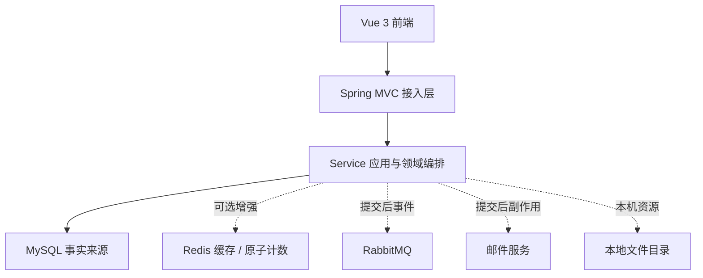
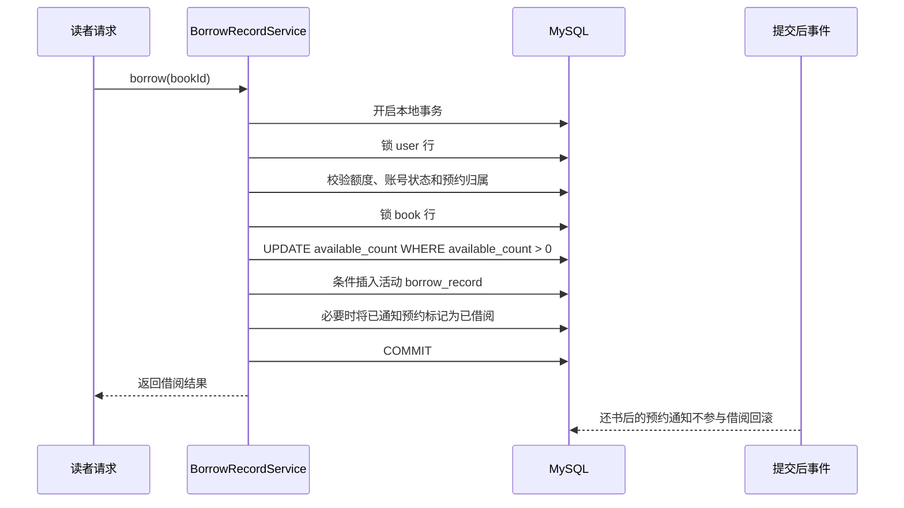
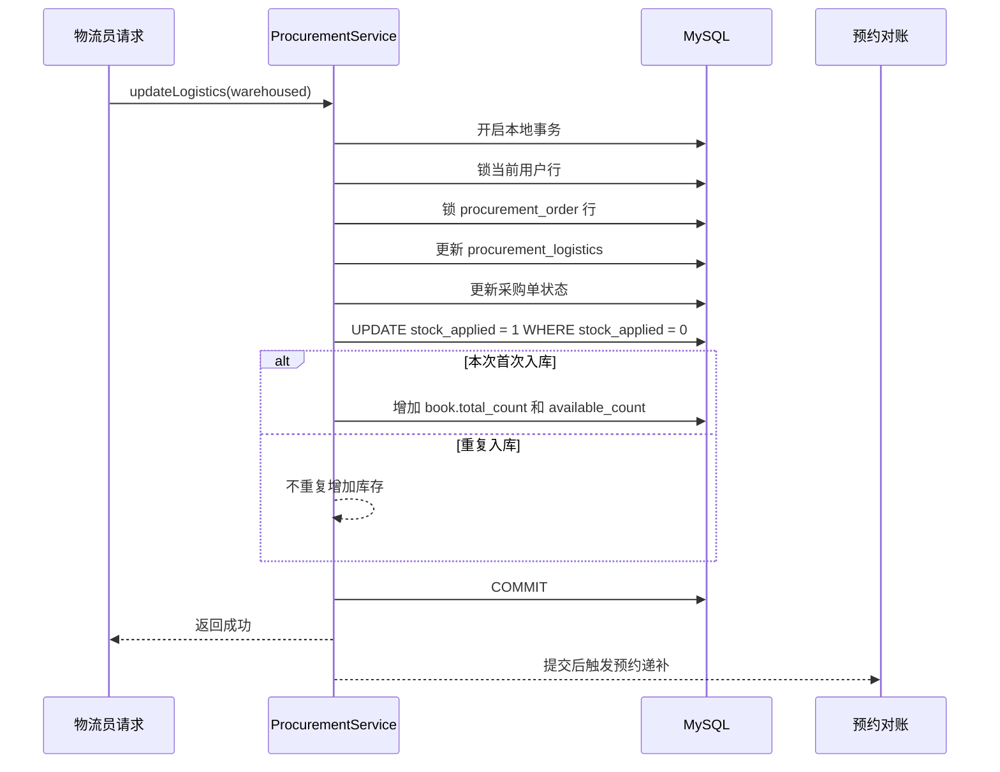
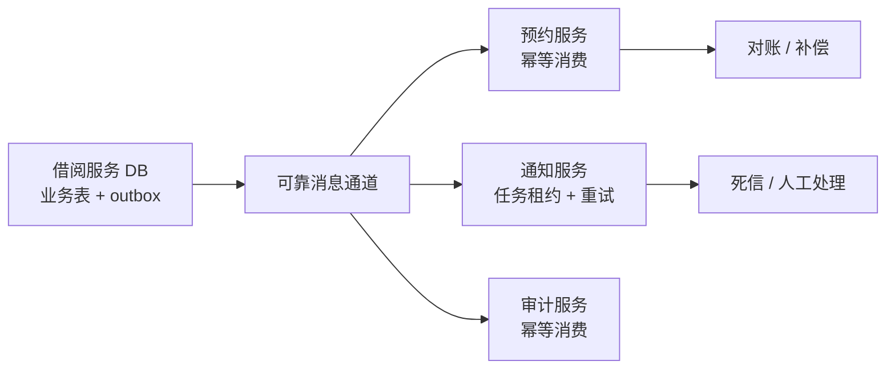

# 暗室藏书架构审查

## 1. 审查范围

本审查针对 2026-07-27 的公开基线，覆盖：

- 请求时序与提交顺序。
- 本地事务边界、行锁和条件更新。
- 两个后端实例共享 MySQL 时的隐性竞态。
- Redis、RabbitMQ、邮件和文件系统的故障边界。
- 如果未来拆分服务，如何演进为可补偿的最终一致性方案。
- 吞吐量、锁粒度和一致性之间的取舍。

当前结论不是“系统已经具备无限扩展能力”，而是确认它在既定的单机 / 小团队边界内，核心业务的强一致性落点清楚，降级行为可解释，未来拆分方向不需要现在就引入分布式事务框架。

## 2. 全局架构取舍

当前系统是共享 MySQL 的模块化 Spring Boot 单体：

选择这个边界的原因：

1. 借阅、库存、预约和采购入库都围绕同一组 MySQL 行展开，本地事务可以直接表达不变量。
2. 采购物流是长流程，但当前只是系统内部角色协作，不是跨公司、跨数据库的资金交易。
3. Redis 和 RabbitMQ 能改善验证码、限流、通知和异步处理，但不是库存和借还的事实来源。
4. 拆成微服务会先带来服务发现、部署、链路追踪、消息幂等和补偿成本；在当前规模下，这些成本不会提高核心借还正确性。

因此，当前代码没有引入 XA、Seata、TCC、Saga 或“异步扣库存”。这不是缺少架构能力，而是有意把强一致边界保留在一个数据库事务内。

## 3. 事务边界与时序

### 3.1 借阅

借阅的强一致内容是“库存扣减、活动借阅记录、预约状态变化”三者同一事务提交或全部回滚。库存扣减使用数据库条件更新，活动借阅使用数据库唯一约束和条件插入，实例数量不会改变这个保证。

锁顺序固定为 `user -> book`。同一读者并发请求会在用户行排队；不同读者竞争同一本书会在图书行排队；不同读者借不同图书仍可以并行。

### 3.2 归还、续借和预约

- 归还与续借先读取请求快照，再按 `user -> book -> borrow_record` 锁定真实行。
- 归还使用 `WHERE status = 0` 的条件更新，只有一个请求能把记录从借阅中改为已归还。
- 库存恢复与归还状态处在同一事务内；库存异常会使事务回滚。
- 预约先锁用户，再锁图书；活动预约数量在用户锁内检查，重复预约由条件插入和唯一索引共同兜底。
- 还书后的预约通知在业务提交后触发，失败由定时对账再次发现，不会反向撤销已经成功的归还。

### 3.3 采购、物流与入库

采购状态、物流状态和入库库存仍然属于同一个本地事务：

采购员和物流员的多用户锁按用户 ID 升序获取，避免“甲锁 A 等 B、乙锁 B 等 A”的常见死锁。订单行是采购单的串行化点；物流表通过订单唯一约束保证一单只有一个物流任务。`stock_applied` 是业务幂等标记，数据库条件更新和事务回滚共同保证库存最多应用一次。

### 3.4 图书编辑与库存操作

管理端编辑表单携带 `book.version`、原始总库存和原始可借库存：

- 普通资料编辑通过版本号拒绝过期表单覆盖新修改。
- 借还和采购入库会递增版本，但不依赖前端表单提交。
- 管理端库存编辑需要原始库存快照，并在图书行锁内检查当前在借数和已通知预约数。

这形成了“管理编辑用乐观版本、库存变化用行锁和条件更新”的组合，不把库存可靠性押给前端状态。

## 4. 多实例与隐性竞态

### 4.1 已由数据库解决的竞态

以下场景已经通过共享 MySQL 的行锁、条件更新、唯一约束或租约解决，两个后端实例可以交错处理：

| 场景 | 保护机制 | 结论 |
| --- | --- | --- |
| 单库存抢借 | `book` 行锁 + `available_count > 0` 条件更新 | 只会成功一次 |
| 同一读者重复借阅 | 活动借阅唯一索引 + 条件插入 | 不产生重复活动记录 |
| 重复归还 | `status = 0` 条件更新 | 只有一次恢复库存 |
| 重复预约 | 用户 / 图书锁 + 活动预约唯一索引 | 只保留一条活动预约 |
| 采购员认领 | 采购单行锁 | 只有一个认领结果胜出 |
| 重复物流入库 | 采购单行锁 + `stock_applied = 0` | 库存只增加一次 |
| 过期预约递补 | 图书行锁 + 首条等待预约行锁 | 不会超额占用可借库存 |
| 到期提醒 | `due_reminder_sent_time IS NULL` 条件更新 | 多实例只入队一次 |
| 通知任务处理 | `processing_token` + 处理租约 | 只有租约持有者能确认结果 |
| 文件清理 | 删除租约状态和过期租约回收 | 多实例不会同时确认同一元数据删除 |
| 书籍过期编辑 | `book.version` 乐观校验 | 旧表单不能覆盖采购或借还库存 |

### 4.2 有意保留的降级边界

这些不是当前核心事务的 bug，但必须在部署说明中明确：

| 能力 | Redis / MQ 正常时 | 依赖故障时 | 多实例含义 |
| --- | --- | --- | --- |
| 验证码 | Redis TTL，原子消费 | 回退到本实例内存 | Redis 故障期间不提供跨实例验证码共享 |
| 登录失败锁定 | Redis 计数与锁定 | 回退到本实例内存 | 多实例下锁定和计数可能按实例分裂 |
| 邮件 | `notification_task` + MQ 触发 | 数据库定时补偿 | 邮件是至少一次语义，极端故障可能重复 |
| 预约递补 | MQ 触发提交后处理 | 定时对账 | 重复触发是可接受的，业务状态本身幂等 |
| 操作审计 | 业务提交后单独写库 | 失败记录日志 | 核心业务不因审计失败回滚；进程在业务提交后崩溃可能缺少审计行 |
| 文件内容 | 本机上传目录 | 数据库只保存元数据 | 两实例不能只共享数据库；生产需要共享盘或对象存储 |

尤其是本地文件目录：当前多实例测试只验证共享 MySQL 下的业务数据一致性，不等价于已经完成共享文件存储部署。若未来横向扩容，必须先把 `FILE_UPLOAD_DIR` 指向可靠共享存储，或者新增对象存储适配层。

### 4.3 定时任务的重复执行

项目没有依赖“某一个实例永远是主节点”。定时任务允许多个实例同时扫描，再由数据库条件更新、行锁和租约决定谁真正完成动作：

- 到期提醒靠借阅记录条件更新。
- 通知发送靠处理租约。
- 预约递补靠图书行锁。
- 文件清理靠删除租约。

这类设计比 JVM 内的 `synchronized` 更适合多实例，但也意味着任务必须保持短批次、可重试和幂等。当前实现的批次大小和重试窗口就是吞吐与锁占用之间的折中。

Redis 适配层会在故障期间记录未完成的删除意图，并在连接恢复后的首次操作前重放。这样可以避免用户已经成功登录后旧锁定键重新生效，也避免本地新验证码生效期间旧 Redis 验证码在恢复后重新出现。这个机制只解决单实例内“故障前 Redis 状态与故障后本地状态”的恢复顺序；它不会把内存兜底升级为跨实例共享状态。

## 5. 提交后副作用与最终一致性

### 5.1 当前单体内的副作用

核心业务事务只负责 MySQL 内的数据事实。邮件、MQ、预约递补和审计通过提交后回调执行，避免“外部调用失败导致已经扣减的库存回滚失败”：

1. 本地事务提交。
2. 注册的提交后任务尝试发布或写入旁路任务。
3. 失败时由数据库中的待处理状态和定时扫描继续补偿。

提交后回调不是事务本身的一部分，因此有两个明确的时间窗口：

- 事务刚提交、进程尚未执行回调时崩溃，通知或审计可能暂时缺失。
- 邮件已发出、进程在写回“已发送”前崩溃，任务租约到期后可能再次发送。

这正是当前系统选择“业务强一致、旁路至少一次”的边界。

### 5.2 如果未来拆成服务

如果未来把借阅、采购、通知或文件拆成独立服务，建议按下面的顺序演进：

1. **先建立事务性 Outbox**：在拥有业务事实的服务数据库中，与业务状态同一事务写入事件。
2. **再做幂等消费**：消费者以 `event_key` 或业务幂等键去重，重复消息只产生一次状态效果。
3. **最后做补偿与死信**：失败消息保留重试次数、最后错误、下一次重试时间和人工处理入口。
4. **长流程再考虑 Saga**：采购到物流到入库是长流程时，用状态机和补偿动作表达“已发货但入库失败”等中间态。
5. **仅在确有独立资源管理器时考虑 XA / TCC**：例如必须同时提交两个无法补偿的外部账本；当前图书馆项目没有这样的业务要求。

未来拆分后的示意：

不建议把当前项目直接改造成“每次借书都走分布式事务”。那会把一个可以由 MySQL 原子完成的库存不变量，换成更长的锁链、更高的延迟和更多故障状态。

## 6. 吞吐量与一致性权衡

### 6.1 当前实现的吞吐特征

- 同一用户的写操作串行化，换取配额、账号状态和预约数量的一致。
- 同一本书的库存相关操作串行化，换取库存不为负和预约保留正确。
- 同一采购单的状态变化串行化，换取物流与入库幂等。
- 不同用户、不同图书、不同采购单可以并行。
- 查询统计尽量在 MySQL 聚合，避免把整月明细加载到 JVM。
- Redis 和 RabbitMQ 只在启用时增加共享计数、缓存和异步能力，不改变核心写模型。

因此，系统的可扩展单元不是“所有请求一起扩展”，而是“独立业务键可以并行，热点业务键按规则排队”。图书馆场景中，热点书籍会自然形成串行点，这是业务一致性的合理成本。

### 6.2 已有验证能说明什么

2026-07-27 的本地证据为：

- 后端 Maven 测试 `225/225` 通过。
- 前端单元测试 `31/31` 通过。
- 五角色真实流程记录 `75` 次 API 响应，采购入库使库存从 `6 -> 8`。
- 单实例并发 `20` 个场景、`393` 次真实 HTTP 请求，最大场景 P95 为 `146 ms`。
- 双实例并发 `6` 个场景、`125` 次请求，最大场景 P95 为 `121 ms`。
- 浏览器 / F12 等价诊断覆盖 `86` 个路由检查、`248` 次 API 响应和 `3968` 次总网络响应，Console、页面异常、失败请求、网络错误和横向溢出均为 `0`。

这些数字是“在当前机器、当前数据量、当前并发脚本下没有破坏不变量”的证据，不是生产容量承诺，也不是完整压测。正式容量评估还需要固定数据规模、连接池、CPU、磁盘、网络、限流配置和持续时间，并分别观察 MySQL 锁等待、慢查询、连接池耗尽、JVM 堆和邮件 / MQ 延迟。

### 6.3 MQ 对延迟的影响

RabbitMQ 事件在业务提交后发布并等待 broker confirm。确认等待有上限，失败会回到数据库补偿或同步递补。因此：

- MQ 正常时，旁路处理可以异步化。
- MQ 确认慢时，请求尾延迟会上升，但核心事务不回滚。
- MQ 不可用时，系统优先保持正确，再牺牲即时异步速度。

这是一项明确的吞吐与可靠性取舍：核心借还不等待邮件完成，通知和审计也不阻塞库存提交；但提交后回调仍会占用请求线程一小段时间，不能把当前 P95 直接外推为高并发容量。

## 7. 审查结论

当前架构没有发现需要用分布式事务才能修复的核心一致性缺口。建议保留以下边界：

1. MySQL 继续作为借还、预约、库存、采购和用户状态的唯一事实来源。
2. 继续使用统一锁顺序、条件更新、唯一约束、乐观版本和数据库租约。
3. 把邮件重复、审计缺失窗口、Redis 本地兜底和本地文件目录写进部署边界，不包装成“全局强一致”。
4. 真正拆服务时先采用事务性 Outbox、幂等消费者、补偿和对账，再根据业务需要引入 Saga。
5. 只有在外部资源无法补偿、且业务确实要求跨资源原子提交时，才评估 XA 或 TCC。

这使当前代码保持一个合理的模块化单体，同时为未来演进留下清晰接口，不制造与项目规模不匹配的奇异架构。
