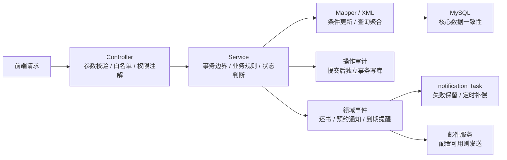
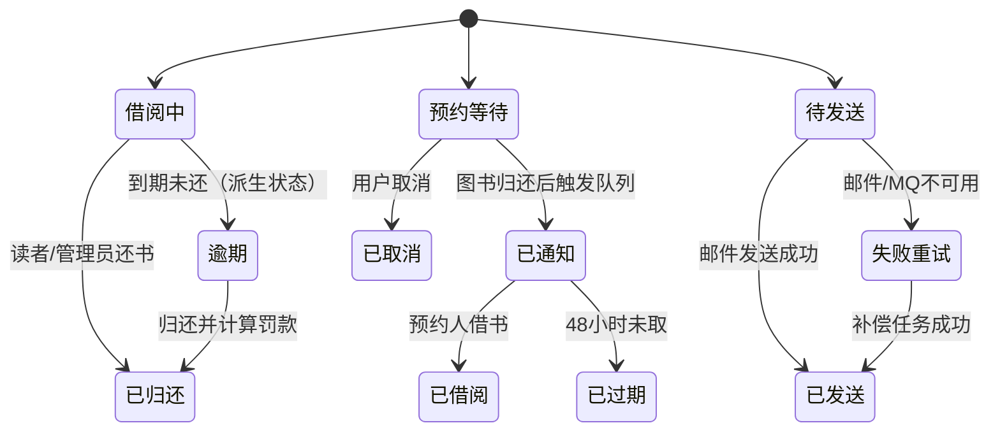

# 图书管理系统功能模块图

本文是可维护的功能结构源文件。系统使用 5 个角色码和 6 个固定权限身份；“普通管理员”与“馆务协调员”都使用管理员角色码，后者通过增强能力标记获得跨管理员协调权限。适合演示的独立页面见 [`library-system-modules.html`](library-system-modules.html)，设计解释见 [`system-design.md`](system-design.md)。

```mermaid
flowchart TB
    System["图书管理系统"]

    System --> Auth["认证与账号模块"]
    System --> Reader["读者端功能"]
    System --> Admin["管理端功能"]
    System --> Procurement["采购物流协作"]
    System --> Support["通用支撑功能"]
    System --> Workflow["后台流程与状态"]
    System --> Data["数据存储"]

    Auth --> Login["登录"]
    Auth --> Register["注册"]
    Auth --> ResetPwd["重置密码"]
    Auth --> Captcha["验证码"]
    Auth --> LoginCaptcha["登录数学验证码"]
    Auth --> CaptchaIsolation["验证码场景隔离"]
    Auth --> CaptchaLimit["验证码每日发送尝试上限"]
    Auth --> SharedEmailLimit["邮箱最多关联 3 个账号"]
    Auth --> EmailChangeVerify["新邮箱换绑验证"]
    Auth --> Jwt["JWT 鉴权"]

    Reader --> BookBorrow["图书借阅"]
    Reader --> MyBorrows["我的借阅"]
    Reader --> MyFavorites["我的收藏"]
    Reader --> MyReservations["我的预约"]
    Reader --> Recommendation["沿着书签"]
    Reader --> MessageBoard["留言板"]
    Reader --> Profile["个人资料"]
    Reader --> Review["书评 / 点赞 / 回复 / 举报"]
    Review --> ReviewSort["最新 / 最热切换"]
    Review --> ReviewLike["点赞 / 取消点赞"]
    Review --> ReviewReply["一级回复"]
    Review --> ReviewReport["举报书评"]

    BookBorrow --> SearchBooks["图书查询"]
    BookBorrow --> BorrowBook["借书"]
    BookBorrow --> FavoriteBook["收藏图书"]
    BookBorrow --> ReserveBook["预约图书"]
    MyBorrows --> ReturnBook["归还图书"]
    MyBorrows --> RenewBook["续借"]
    Recommendation --> ExplainableFeed["可解释内容荐书"]
    Recommendation --> PublicFallback["公共荐书降级"]
    Recommendation --> RecommendationPrivacy["个性化开关 / 清除记录"]

    Admin --> Dashboard["数据总览"]
    Admin --> Statistics["统计看板"]
    Admin --> UserManage["用户管理"]
    Admin --> BookManage["图书管理"]
    Admin --> CategoryManage["分类管理"]
    Admin --> BookshelfManage["书架管理"]
    Admin --> BorrowManage["借阅管理"]
    Admin --> NoticeManage["公告管理"]
    Admin --> ContentAudit["内容审核"]
    Admin --> MessageManage["留言管理"]
    Admin --> OperationLog["操作日志"]
    Admin --> DataExport["数据导出"]
    Admin --> FileManage["文件管理（仅超级管理员）"]
    Admin --> ProcurementOverview["采购进度查看"]

    BookManage --> BookCrud["图书增删改查"]
    BookManage --> BookRestore["软删除与恢复"]
    CategoryManage --> CategoryCrud["分类增删改查"]
    BookshelfManage --> BookshelfCrud["书架增删改查"]
    BorrowManage --> AdminReturn["管理员代还"]
    NoticeManage --> NoticeCrud["公告发布与维护"]
    ContentAudit --> ReviewReportManage["书评举报审核"]
    ContentAudit --> HideReview["隐藏违规书评"]
    MessageManage --> MessageReply["留言查看与回复"]
    UserManage --> RoleManage["用户角色与状态管理"]
    UserManage --> CoordinatorAdminManage["馆务协调员任免（仅超级管理员）"]
    UserManage --> FreezeManage["冻结/解冻用户"]
    UserManage --> WordManage["禁言/解禁用户"]
    Admin --> StateAudit["审核与状态跟踪"]
    StateAudit --> UserStateAudit["用户状态审核"]
    StateAudit --> MessageStateAudit["留言回复状态"]
    StateAudit --> ReservationStateAudit["预约状态流转"]
    StateAudit --> BorrowStateAudit["借阅/逾期状态"]
    StateAudit --> NotifyStateAudit["通知补偿状态"]
    StateAudit --> ReviewReportAudit["书评举报待审核"]
    StateAudit --> ProcurementAudit["采购/物流进度跟踪"]

    Procurement --> LowStockEntry["低库存采购入口"]
    Procurement --> ProcurementOrder["采购单管理"]
    Procurement --> AdminPurchaserChat["管理员 / 采购员对话"]
    Procurement --> PurchaserLogisticsChat["采购员 / 物流员对话"]
    Procurement --> LogisticsProgress["物流进度同步"]
    Procurement --> StockIn["入库后自动补充库存"]
    Procurement --> SuperAdminAudit["超级管理员全局审计"]
    ProcurementOrder --> CreatePurchase["管理员创建采购需求"]
    ProcurementOrder --> AssignPurchaser["指派 / 认领采购员"]
    ProcurementOrder --> PurchaseStatus["待采购 / 采购中 / 已下单 / 已发货 / 已到货 / 已入库 / 已完成 / 已取消"]
    LogisticsProgress --> AssignLogistics["采购员分配物流员"]
    LogisticsProgress --> LogisticsStatus["待接收 / 运输中 / 已到馆 / 已入库"]
    AdminPurchaserChat --> AdminPurchaserRead["已读 / 未读"]
    PurchaserLogisticsChat --> LogisticsRead["已读 / 未读"]
    SuperAdminAudit --> AuditScope["采购单 / 物流流转 / 跨岗位消息 / 已读未读"]

    Support --> FileLifecycle["文件生命周期管理"]
    FileLifecycle --> FileUpload["文件上传与元数据登记"]
    FileLifecycle --> FileBind["业务引用绑定与释放"]
    FileLifecycle --> FileAccess["公开预览 / 鉴权下载"]
    FileLifecycle --> FileCleanup["临时文件 / 孤立文件定时清理"]
    Support --> OperationAudit["操作审计"]
    Support --> LoginProtection["登录失败限流与账号锁定"]
    Support --> RequestTrace["请求 ID 与日志关联"]
    Support --> BrowserSecurity["CSP 与浏览器安全响应头"]
    Support --> Fine["逾期罚款计算"]
    Support --> Export["Excel 数据导出"]
    Support --> ViewStats["访问量统计"]
    Support --> QueryCache["查询缓存（Redis 可降级）"]
    Support --> EmailNotify["邮件通知（补偿机制）"]
    Support --> DueReminder["到期提醒邮件"]
    Support --> ReservationNotify["预约到货通知"]
    Support --> RenewManage["续借管理"]
    Support --> LowStockAlert["低库存告警"]
    Support --> DegradableMiddleware["可降级中间件"]
    DegradableMiddleware --> RedisFallback["Redis 异常：内存 / MySQL 兜底"]
    DegradableMiddleware --> MqFallback["RabbitMQ 异常：数据库任务 / 定时补偿"]
    DegradableMiddleware --> DeadLetterAlert["死信积压监控 / Webhook 告警"]

    Workflow --> RequestFlow["后台请求处理流程"]
    RequestFlow --> ControllerFlow["Controller 参数校验 / 权限注解"]
    ControllerFlow --> ServiceFlow["Service 事务编排 / 业务规则"]
    ServiceFlow --> MapperFlow["Mapper 条件更新 / MySQL 一致性"]
    ServiceFlow --> CacheFlow["缓存增强 / Redis 降级"]
    ServiceFlow --> EventFlow["领域事件 / 邮件通知 / MQ 降级"]
    EventFlow --> CompensationFlow["notification_task 补偿重试"]
    ServiceFlow --> AuditFlow["操作日志审计"]

    Workflow --> StateFlow["关键状态流转"]
    StateFlow --> UserState["用户：正常 / 禁用 / 禁言"]
    StateFlow --> BorrowState["借阅：借阅中 / 已归还 / 逾期派生"]
    StateFlow --> ReservationState["预约：等待 / 已通知 / 已借阅 / 已取消 / 已过期"]
    StateFlow --> MessageState["留言：待回复 / 已回复"]
    StateFlow --> NotifyState["通知：待发送 / 已发送 / 失败重试"]
    StateFlow --> ReviewReportState["书评举报：待处理 / 已处理 / 忽略"]
    StateFlow --> ReviewState["书评：正常 / 隐藏"]
    StateFlow --> BookState["图书：在架 / 借出 / 软删除"]
    StateFlow --> ProcurementState["采购：待采购 / 采购中 / 已下单 / 已发货 / 已到货 / 已入库 / 已完成 / 已取消"]
    StateFlow --> LogisticsState["物流：待接收 / 运输中 / 已到馆 / 已入库"]
    StateFlow --> CollaborationState["协作消息：未读 / 已读"]

    Data --> UserTable["用户数据"]
    Data --> BookTable["图书数据"]
    Data --> CategoryTable["分类数据"]
    Data --> BookshelfTable["书架数据"]
    Data --> BorrowTable["借阅记录"]
    Data --> FavoriteTable["收藏记录"]
    Data --> RecommendationSettingTable["推荐隐私设置"]
    Data --> RecommendationBatchTable["推荐批次与条目"]
    Data --> RecommendationEventTable["曝光 / 点击 / 收藏归因"]
    Data --> ReservationTable["预约记录"]
    Data --> ReviewTable["评论数据"]
    Data --> ReviewLikeTable["评论点赞数据"]
    Data --> ReviewReplyTable["评论回复数据"]
    Data --> ReviewReportTable["评论举报数据"]
    Data --> NoticeTable["公告数据"]
    Data --> LogTable["操作日志"]
    Data --> NotifyTaskTable["通知补偿任务"]
    Data --> MessageTable["留言板数据"]
    Data --> ProcurementOrderTable["采购单数据"]
    Data --> ProcurementLogisticsTable["采购物流数据"]
    Data --> ProcurementMessageTable["采购协作消息"]
    Data --> StoredFileTable["文件元数据与引用"]
```

## 后台流程图

## 关键状态流转

## 模块说明

| 一级模块 | 主要功能 |
| --- | --- |
| 认证与账号模块 | 登录、注册、重置密码、邮箱验证码、登录数学验证码、验证码场景隔离与每日发送尝试上限、邮箱三账号上限、新邮箱换绑验证、JWT 鉴权、认证版本失效 |
| 读者端功能 | 图书查询、借阅、归还、续借、收藏、预约、可解释荐书、公共降级、不感兴趣、隐私开关、推荐记录清除、留言、个人资料与书评互动 |
| 管理端功能 | 用户（含冻结/解冻/禁言与馆务协调员任免）、图书（含软删除恢复）、分类、书架、借阅、公告、内容审核、留言回复、书评举报状态跟踪、日志、统计、导出和超级管理员文件管理 |
| 采购物流协作 | 普通管理员只处理自己创建的采购需求并和采购员沟通；采购员认领/推进采购、分配物流员；物流员同步自己的物流进度；入库后自动补充图书库存；协作消息支持已读/未读；超级管理员拥有全局审计视角 |
| 通用支撑功能 | 文件上传、元数据登记、引用绑定与释放、公开预览、鉴权下载、临时/孤立文件定时清理、操作审计、请求 ID、CSP 与浏览器安全响应头、IP 接入限流、登录失败限流与账号锁定、逾期罚款、查询缓存、邮件通知（补偿）、死信积压告警、到期提醒邮件、预约到货通知、续借管理、低库存告警、访问统计、数据导出、Redis/RabbitMQ 可降级增强 |
| 后台流程与状态 | Controller 校验、Service 事务、Mapper 条件更新、缓存降级、领域事件、通知补偿、操作审计、借阅/预约/留言/通知/举报/采购/物流状态流转 |
| 数据存储 | 23 张业务与派生表保存用户、馆藏、流通、推荐、互动、采购物流、通知和文件数据；邮箱配额技术表负责跨实例三账号上限 |

## 当前验证基线

本模块图对应 2026-08-02 的 v1.2.3 冻结验收：Spring Boot 3.5.16、Vue 3.5.40、Vite 8.1.5，后端端口 `20606`、前端端口 `5175`。后端 282 项、前端 68 项、6 个固定权限身份 73 次真实 API 全链路通过；三实例本轮完成 8 个一致性场景、176 次请求和 4 个边界场景、76 次请求，独立并发套件完成 20 个场景、393 次请求，历史 1,986 次强并发基线与推荐三实例确定性结果继续有效；浏览器诊断完成 116 个路由、456 次 API 和 6,206 次网络响应，详情见 [`verification-report.md`](verification-report.md) 与 [`architecture-review.md`](architecture-review.md)。
