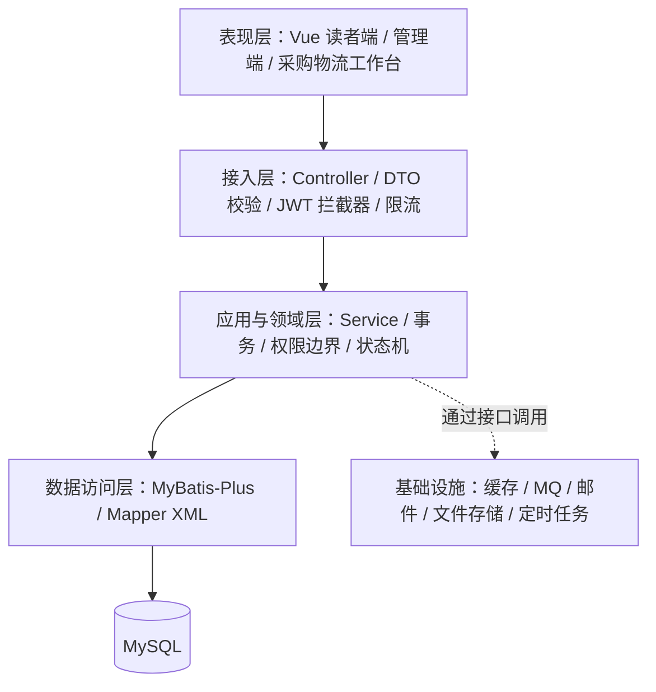
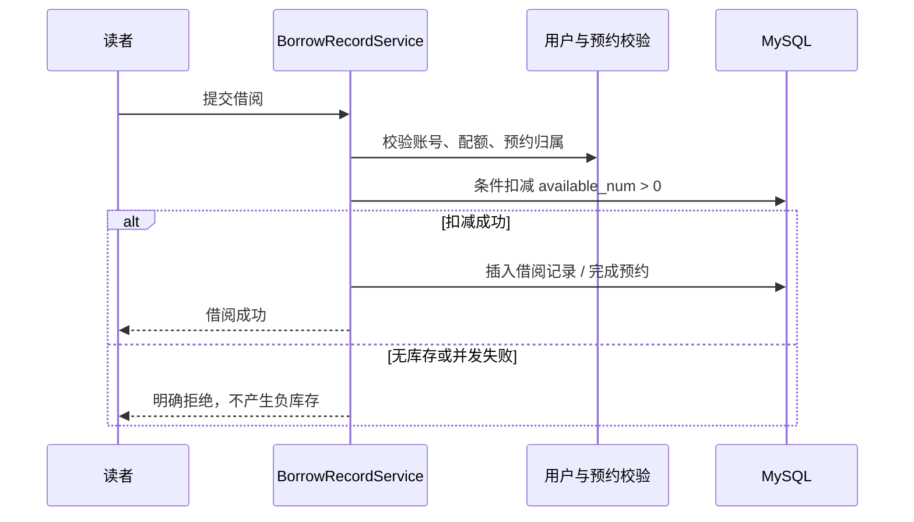
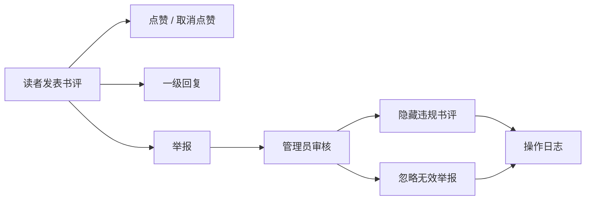
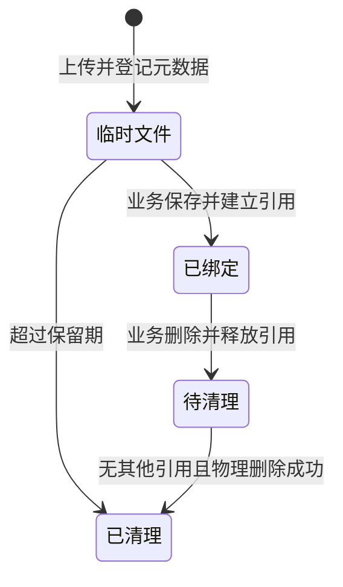

# 暗室藏书系统设计

本文解释系统为什么这样分层、5 个角色码对应的 6 个固定权限身份怎样协作、核心数据如何保持一致，以及 Redis、RabbitMQ 和邮件不可用时系统如何继续工作。更细的时序、事务边界、多实例竞态和未来服务拆分方案见 [`architecture-review.md`](architecture-review.md)。

## 1. 设计目标与边界

项目面向单机或小团队部署，优先保证：

1. 核心借还业务正确，库存不能为负，失败时数据能够回滚。
2. 5 个角色码与 6 个固定权限身份职责清晰，跨岗位协作有通信、有状态、有审计。
3. 中间件提供性能与异步能力，但不能绑架系统启动和主流程。
4. 前端有项目气质，后台仍保持可读、可操作和可验收。

因此系统采用增强型 Spring Boot 单体，而不是微服务。MySQL 是最终事实来源；Redis 和 RabbitMQ 都是可替换的基础设施增强。

## 2. 分层结构

- **Controller**：接收参数、触发校验和权限注解，不直接编写 SQL。
- **Service**：承载事务、角色边界、状态判断和跨表编排。
- **Mapper/XML**：执行条件更新、分页查询和统计聚合。
- **基础设施适配层**：封装 Redis、RabbitMQ、邮件和文件系统，业务服务不依赖具体中间件实现。

当前后端基线为 JDK 17、Spring Boot 3.5.16 和 MyBatis-Plus 3.5.17。框架升级已完成 Jakarta API、JWT 新接口、MySQL 驱动和批处理调用适配；RabbitMQ 反序列化只信任项目领域模型包。

## 3. 五个角色码与六个固定权限身份

系统只有五个基础角色编码：

| 编码 | 角色 | 数据范围 |
| ---: | --- | --- |
| 0 | 超级管理员 | 全局用户、文件、审计和采购物流数据 |
| 1 | 管理员 | 馆藏、流通、内容审核及职责范围内的采购需求 |
| 2 | 读者 | 自己的借阅、预约、收藏、留言和互动数据 |
| 3 | 采购员 | 可认领或分配给自己的采购单及对应通信 |
| 4 | 物流员 | 分配给自己的物流任务及对应通信 |

固定验收身份为超级管理员、馆务协调员、普通管理员、读者、采购员和物流员。“馆务协调员”是管理员记录上的 `is_coordinator_admin` 能力标记，因此它与普通管理员是两个权限身份，但不增加第六个角色码：

- 只能由超级管理员任免。
- 可以跨普通管理员协调采购事项。
- 不能获得超级管理员专属的文件治理、完整导出和全局账号控制权。

这种设计在效率和权责之间做了折中：紧急协调不必全部等待超级管理员，但最终授权和全局审计仍由超级管理员掌握。

## 4. 借阅、续借与预约闭环

### 4.1 借书

库存只在 MySQL 中同步扣减。借阅记录插入失败时，事务整体回滚；Redis 不保存最终库存。

为避免并发借阅、图书编辑和账号注销相互覆盖，事务统一先锁用户行、再锁图书行。`borrow_record` 使用生成列 `active_flag` 和唯一索引 `uk_borrow_active(user_id, book_id, active_flag)`，从数据库层阻止同一读者对同一本书产生两条活动借阅。续借、归还和预约取消同时使用记录行锁或期望旧状态条件更新，避免重复提交改变已经完成的状态。

### 4.2 续借

- 每条借阅记录最多续借一次。
- 仅在到期前三天内开放。
- 图书存在有效预约队列时禁止续借。
- 到期前三天发送一次温和邮件提醒，邮件失败不改变借阅状态。

### 4.3 预约

- 无可借库存时进入 FIFO 预约队列，并限制每位读者的有效预约数量。
- 归还后最早预约者变为“已通知”，图书在保留期内不能被其他人抢走。
- 预约人借书后状态变为“已借阅”；取消或超时分别变为“已取消”“已过期”。

## 5. 逾期与罚款

- 逾期天数由到期时间和归还时间计算。
- 罚款按规则累计，并以图书价格为封顶值。
- 归还、罚款计算和库存恢复处于同一业务事务中。
- 邮件催还或提醒属于旁路通知，失败不会回滚还书。

## 6. 书评与内容审核

书评支持最新/最热排序。留言、书评、回复、采购消息都有长度限制和内容净化；公告允许受控富文本，但危险脚本和标签会被移除。

## 7. 采购物流协作

通信被拆成两个隔离通道：

- 管理员 ↔ 采购员
- 采购员 ↔ 物流员

物流员不能直接调度管理员，管理员也不能绕过采购员直接控制物流任务。消息支持已读/未读；状态流转记录操作者、时间、前后状态和备注。重复入库通过状态与更新条件避免重复增加库存。

## 8. 可降级中间件

| 能力 | 正常路径 | 降级路径 | 是否影响主业务 |
| --- | --- | --- | --- |
| 验证码存储 | Redis TTL | 本地并发 Map | 否 |
| 登录风控 | Redis 计数与锁定 TTL | 本地内存计数 | 否 |
| 查询缓存 | Redis | 直接查询 MySQL | 否 |
| 操作日志 | 业务提交后单独写 MySQL | 记录失败并保留错误日志 | 否；核心业务不因审计失败回滚 |
| 通知事件 | RabbitMQ 异步消费 | 写入 `notification_task` | 否 |
| 邮件发送 | SMTP | 记录失败并定时重试 | 借还/预约不受影响 |

验证码发送本身属于用户正在等待的结果，因此邮件配置缺失时会明确返回失败，而不是伪装成功。

## 9. 文件生命周期

- 图书封面和公开头像可按规则预览。
- 留言附件需要权限校验；PDF、Word、图片和 HTML 可上传。
- HTML 强制下载，不能在站点上下文中直接执行。
- 超级管理员可以查看文件状态并触发安全清理。
- 定时任务清理过期临时文件和无业务引用的孤立文件。

## 10. 安全与审计

- BCrypt 存储密码，JWT 校验登录身份。
- 登录数学验证码、邮箱验证码用途隔离、重发间隔和每日上限。
- 同一规范化邮箱最多关联 3 个账号；界面公开固定规则，但接口不返回当前关联数量或账号身份。
- 公开注册先验证邮箱控制权，再检查账号、署名和邮箱配额；个人资料换绑使用受登录保护的 `CHANGE_EMAIL` 验证码。
- 连续登录失败触发临时锁定；可信代理头必须显式开启。
- `@RequireRole` 负责接口角色边界，Service 再校验数据归属和敏感操作。
- 普通管理员不能修改同级、馆务协调员或超级管理员。
- 冻结/解冻、禁言/解禁、角色变化、内容审核、采购和物流流转均记录审计日志。
- 用户导出按调用者角色过滤敏感字段。
- 用户名由数据库唯一约束和服务层冲突处理共同保护，资料字段在保存前统一去除首尾空白并校验。
- 存活和就绪探针只公开最小状态；数据库、文件目录和中间件分项详情仅超级管理员可查看。

## 11. 可解释荐书与隐私边界

“沿着书签”位于读者阅览室底部，不建立第二份用户行为事实表。推荐只读取现有收藏、借阅和书评数据，并遵守以下约束：

- 收藏是主要兴趣信号；借阅次数与 4 分以上评分只作辅助，2 分及以下评分作为明确负反馈。
- 收藏少于 3 本、读者关闭个性化或没有可用候选时，退回新近入藏、质量与可借性组合的公共荐书。
- 内容召回使用分类、作者、出版社与书名/简介词元；只有至少 2 名独立读者形成共同收藏时才叠加 item-based 协同信号，不伪造“大家都喜欢”。
- 当前收藏、活动借阅和明确低分图书会被过滤；重排优先保证前三项作者不重复、同分类不过度集中。
- 每条推荐理由由实际命中的作者、分类、共同收藏、热度或新书来源生成，不使用大模型分析书评，也不保存无关浏览轨迹。

推荐输出保存在 `recommendation_batch` 与 `recommendation_item`，曝光、点击、推荐后收藏和“不感兴趣”以不可变事件写入 `recommendation_event`；`recommendation_user_setting` 保存读者开关。事件写入采用 `INSERT IGNORE` 与唯一键实现数据库原生幂等。“不感兴趣”会把对应图书从后续 30 天的候选中排除，但不修改原始业务事实。

生成时先锁定当前用户行，同一读者跨实例只能串行生成。Redis 可用时，全局和用户两级版本令牌构成来源指纹，相关业务事务提交后使令牌失效；令牌不变且批次在 6 小时内即可复用，不必每次聚合全部图书和行为。Redis 关闭或暂时不可用时自动回退到 MySQL 聚合指纹，正确性不依赖缓存。时间统一截断到数据库秒精度，保证首个生成响应与后续复用响应一致。

读者可以关闭个性化，也可以清除推荐批次、条目和归因事件。清除不会删除收藏、借阅或书评，因为它们是用户主动创建的原始业务记录。收藏归因在收藏事务提交后以独立事务执行；即使归因失败，也不能回滚已经成功的收藏。

## 12. 运行与前端加载边界

- 前端路由按页面动态加载，ECharts 运行时只在统计图表实际挂载时加载。
- 图表公共核心与折线、柱状、饼图运行时分别延迟加载；当前公共核心为 `466.89 KB`（gzip `158.09 KB`），各图型增量为 `15.98-27.13 KB`，均不进入普通页面首屏。
- GitHub Actions 对后端测试、前端静态检查/单测/构建/依赖审计和 Compose 配置执行持续验证。
- Docker Compose 是本地演示和隔离测试的可选入口，不改变本机直接运行方式。

## 13. 数据库分组

23 张业务与派生表按职责分为：

| 分组 | 表 |
| --- | --- |
| 用户与馆藏 | `user`、`category`、`bookshelf`、`book` |
| 流通 | `borrow_record`、`book_favorite`、`book_reservation` |
| 可解释荐书 | `recommendation_user_setting`、`recommendation_batch`、`recommendation_item`、`recommendation_event` |
| 内容互动 | `notice`、`book_review`、`book_review_like`、`book_review_reply`、`book_review_report`、`message_board` |
| 审计与通知 | `operation_log`、`notification_task` |
| 采购物流 | `procurement_order`、`procurement_logistics`、`procurement_message` |
| 文件治理 | `stored_file` |

`user_email_quota` 是独立的技术控制表，不计入 23 张业务与派生表。注册预占、资料换绑和物理删除都在用户事务中更新配额；配额行通过 `INSERT ... ON DUPLICATE KEY UPDATE` 从第一条语句起取得排他锁，避免共享锁升级死锁。多个邮箱同时变更时按规范化邮箱排序加锁，条件更新保证同一邮箱不会超过 3 个账号。

初始化脚本包含 34 条外键约束，并通过唯一索引、状态字段和邮箱配额行限制重复点赞、重复预约、重复推荐事件、重复物流入库及超额邮箱关联等非法状态。

## 14. 测试策略

- H2 集成测试覆盖 Service、Controller、安全和并发场景。
- 并发库存测试验证库存为 1 时只有一个借阅成功。
- 权限测试覆盖导出字段、文件访问、管理员边界和六身份协作流转。
- 用户测试覆盖账号/署名/密码/邮箱组合、12 路同邮箱并发注册、换绑与删除释放，以及验证码前防枚举。
- 三实例邮箱配额 E2E 将 100 个同邮箱新增请求分发到三个 JVM，要求恰好 3 个成功、其余全部明确拒绝且不能出现 HTTP 500。
- 推荐测试覆盖三收藏阈值、内容/公共/协同模式、过滤与多样性、确定性排序、隐私开关、数据库原生事件幂等、“不感兴趣”排除和历史清除；三实例 E2E 同时验证首次生成只落一个批次及真实 `HYBRID` 协同结果一致。
- 内容安全测试覆盖长度限制、富文本净化和非法附件。
- 前端提供规则单测，以及读者、管理员、采购物流、全流程、并发一致性和浏览器诊断脚本。
- 自动回归覆盖 Redis/RabbitMQ 正常链路与核心降级逻辑；人工验收继续负责真实 SMTP 收件和部署环境差异。

2026-07-27 公开基线与 v1.2.0 增量回归为：后端 241 项、前端 37 项全部通过；6 个固定权限身份全链路通过；既有三个后端实例强并发基线按突发量 96、128、160 分三批执行 1,986 次场景请求，新增推荐再以 3 个实例同时首次生成，最终只落一个确定性批次，并通过临时真实数据验证三实例 `HYBRID` 协同结果一致；最新浏览器诊断完成 116 个路由检查、352 次 API 响应和 6,102 次总网络响应；数据库库存范围、活动借阅/预约唯一性、推荐事件唯一性、采购入库幂等、邮箱配额和 34 个外键关系均无异常。完整证据见 [`verification-report.md`](verification-report.md)。

## 15. 为什么不做微服务

当前规模下，微服务会引入服务发现、分布式事务、链路追踪和部署复杂度，却不会改善核心借阅正确性。单体分层配合接口适配层已经能够做到职责隔离、可测试和中间件可替换，更符合项目目标。

当前明确采用“核心业务本地强一致、提交后副作用最终一致”的取舍：

- 借阅、归还、预约、采购状态、物流状态和入库库存由同一个 MySQL 本地事务完成。
- 邮件、预约递补和操作审计不参与核心事务回滚；它们通过数据库任务、提交后回调、租约、重试和定时对账恢复。
- Redis 不可用时的验证码和登录风控回退到本实例内存，因此多实例部署不能把 Redis 故障期间的安全计数理解为全局强一致。
- 文件元数据可以共享，但当前文件内容位于本地目录；多实例部署必须使用共享盘或对象存储。

如果未来确实拆分服务，演进顺序应是事务性 Outbox、幂等消费者、补偿和对账，必要时再为长流程引入 Saga。只有出现无法补偿的独立资源提交，才评估 XA 或 TCC；当前项目没有这样的业务边界。
